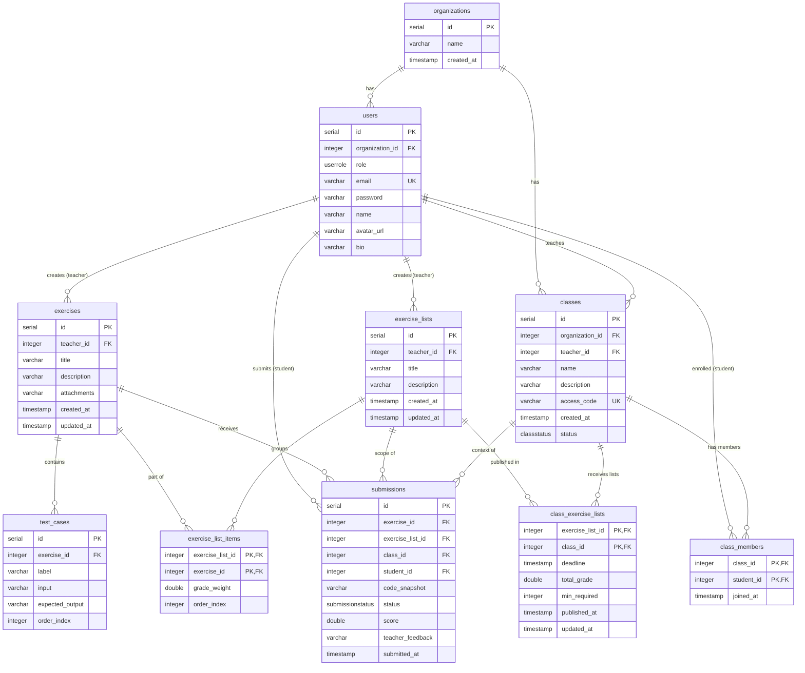

# Java-- Compiler & IDE

Monorepo containing a TypeScript-based compiler/interpreter for **Java--** (a simplified subset of Java), a web IDE built with Next.js + Monaco Editor, and a FastAPI backend that powers the LMS features (classes, exercises, submissions).

<p align="center">
  <a href="#architecture">Architecture</a> &nbsp;|&nbsp;
  <a href="#installation">Installation</a> &nbsp;|&nbsp;
  <a href="#database">Database</a> &nbsp;|&nbsp;
  <a href="#instructions">Instructions</a> &nbsp;|&nbsp;
  <a href="#contributing">Contributing</a>
</p>


## Architecture

The project is split into three independent packages:

| Package | Stack | Purpose |
|---------|-------|---------|
| [`packages/compiler`](./packages/compiler) | TypeScript, Vitest | Lexer, parser, IR generator, and interpreter for Java-- |
| [`packages/ide`](./packages/ide) | Next.js 16, React 19, Monaco, Tailwind v4 | Web IDE with editor, terminal, token analysis, and LMS UI |
| [`backend`](./backend) | FastAPI, SQLAlchemy (async), Alembic, PostgreSQL | REST API for auth, classes, exercises, submissions |

### Compiler pipeline

```
input-code.java → Lexer → Token[] → TokenIterator → Parser (+ IR Emitter) → Instruction[] → Interpreter → Output
```

- **Lexer**: character-by-character scanning via a factory of specialized scanners (comments, identifiers, numbers, strings, operators).
- **Parser**: recursive-descent — one file per grammar production under `packages/compiler/src/grammar/syntax/`.
- **IR**: three-address code with temporary variables (`__temp0`, `__temp1`, ...) and labels for control flow.
- **Interpreter**: executes the IR using a symbol table, label table, and instruction pointer. I/O is abstracted via injectable `stdout`/`stdin` callbacks.

## Installation

### Compiler

```bash
cd packages/compiler
npm install && npm run start   # runs against src/resource/input-code.java
npm run test                   # Vitest
```

### IDE

```bash
cd packages/ide
npm install && npm run dev     # http://localhost:3001
```

The IDE consumes the compiler as a local workspace dependency (`@ts-compilator-for-java/compiler`).

### Backend (FastAPI)

```bash
cd backend
uv sync
uv run alembic upgrade head    # apply DB migrations
uv run uvicorn app.main:app --reload
```

Or run the full stack with Docker:

```bash
docker-compose up
```

## Database

PostgreSQL schema for the LMS layer (organizations, classes, exercises, submissions). Migrations are managed by Alembic — see [`backend/migrations/`](./backend/migrations).



Reference files:
- Raw SQL dump: [`tcc/victor/db.sql`](./tcc/victor/db.sql)
- DBML (dbdiagram.io): [`tcc/victor/dbdocs.txt`](./tcc/victor/dbdocs.txt)
- Extended diagram with legends: [`tcc/victor/db-diagram.md`](./tcc/victor/db-diagram.md)

## Instructions

Each package has its own README with implementation details:

- [Compiler README](./packages/compiler/README.md)
- [IDE README](./packages/ide/README.md)
- [Backend README](./backend/README.md)

To test the compiler with custom code, edit `packages/compiler/src/resource/input-code.java` and run `npm run start`.

The compiler entry point is `packages/compiler/src/index.ts`.

[Original specification (PDF)](./packages/compiler/public/java--descriptionWork.pdf)

## Repository Layout

```
.
├── backend/            # FastAPI + SQLAlchemy + Alembic
├── packages/
│   ├── compiler/       # Lexer, parser, IR, interpreter
│   └── ide/            # Next.js IDE
├── tcc/                # Undergraduate thesis (LaTeX)
│   ├── igor/
│   └── victor/         # Includes db.sql, dbdocs.txt, db-diagram.md
├── docs/
├── qualificacao/       # Qualification documents
├── CLAUDE.md           # Project guidance for Claude Code
├── DESIGN.md           # Design decisions
└── docker-compose.yml
```

## Contributing

Contributions are welcome — especially new test cases and language feature suggestions. Open an issue or PR.

## Authors

- Igor Lamoia
- Victor Souza
