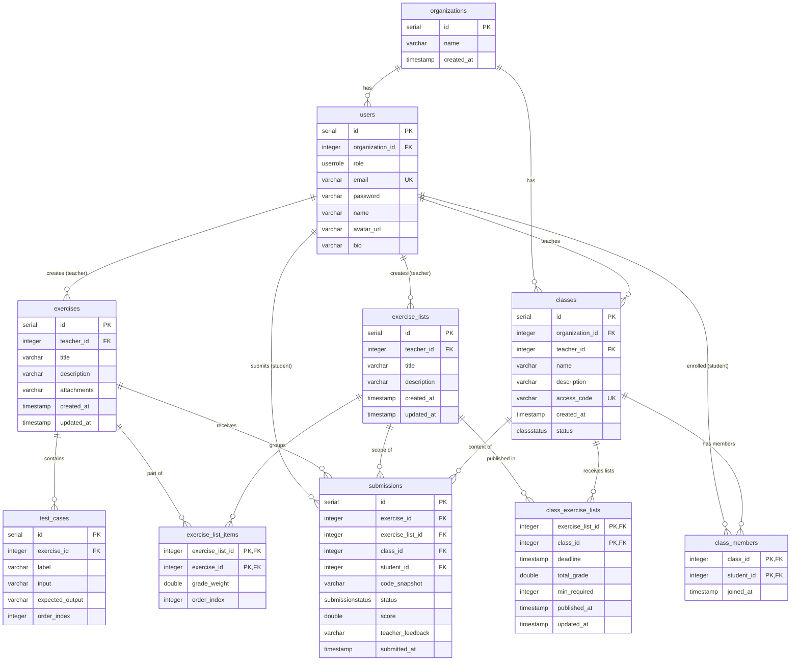

# Java-- Compiler & IDE

Monorepo containing a TypeScript-based compiler/interpreter for **Java--** (a simplified subset of Java), a web IDE built with Next.js + Monaco Editor, and a FastAPI backend that powers the LMS features (classes, exercises, submissions).

<p align="center">
  <a href="#architecture">Architecture</a> &nbsp;|&nbsp;
  <a href="#installation">Installation</a> &nbsp;|&nbsp;
  <a href="#database">Database</a> &nbsp;|&nbsp;
  <a href="#instructions">Instructions</a> &nbsp;|&nbsp;
  <a href="#contributing">Contributing</a>
</p>


## Architecture

The project is split into three independent packages:

| Package | Stack | Purpose |
|---------|-------|---------|
| [`packages/compiler`](./packages/compiler) | TypeScript, Vitest | Lexer, parser, IR generator, and interpreter for Java-- |
| [`packages/ide`](./packages/ide) | Next.js 16, React 19, Monaco, Tailwind v4 | Web IDE with editor, terminal, token analysis, and LMS UI |
| [`backend`](./backend) | FastAPI, SQLAlchemy (async), Alembic, PostgreSQL | REST API for auth, classes, exercises, submissions |

### Compiler pipeline

```
input-code.java → Lexer → Token[] → TokenIterator → Parser (+ IR Emitter) → Instruction[] → Interpreter → Output
```

- **Lexer**: character-by-character scanning via a factory of specialized scanners (comments, identifiers, numbers, strings, operators).
- **Parser**: recursive-descent — one file per grammar production under `packages/compiler/src/grammar/syntax/`.
- **IR**: three-address code with temporary variables (`__temp0`, `__temp1`, ...) and labels for control flow.
- **Interpreter**: executes the IR using a symbol table, label table, and instruction pointer. I/O is abstracted via injectable `stdout`/`stdin` callbacks.

## Installation

### Compiler

```bash
cd packages/compiler
npm install && npm run start   # runs against src/resource/input-code.java
npm run test                   # Vitest
```

### IDE

```bash
cd packages/ide
npm install && npm run dev     # http://localhost:3001
```

The IDE consumes the compiler as a local workspace dependency (`@ts-compilator-for-java/compiler`).

### Backend (FastAPI)

```bash
cd backend
uv sync
uv run alembic upgrade head    # apply DB migrations
uv run uvicorn app.main:app --reload
```

Or run the full stack with Docker. For local development, use the isolated
composition below. The Make targets ignore the root `.env`, and the Compose
file always connects the backend to its own PostgreSQL container:

```bash
make local-up
```

The local services are available at:

- IDE: <http://localhost:3001>
- Backend API: <http://localhost:8000>
- API docs: <http://localhost:8000/docs>
- PostgreSQL: `localhost:5434` (`tscompilator_local` database)

Useful commands:

```bash
make local-status       # container and health status
make local-logs         # follow logs from the complete stack
make local-down         # stop containers, preserving local data
make local-reset        # stop and delete only the local database volume
```

`make local-reset` is intentionally destructive, but it is scoped to the
`ts-compilator-local-postgres-data` Docker volume. On startup, the backend
waits for PostgreSQL, applies Alembic migrations, seeds local sample data, and
then becomes healthy. Ports can be overridden with `LOCAL_FRONTEND_PORT`,
`LOCAL_BACKEND_PORT`, `LOCAL_DB_PORT`, and `LOCAL_API_URL`.

The idempotent seed also publishes five ready-to-import official languages in
the community catalog: Didática em Português, Pythonica, Minimalista,
Ruby-like, and Minerês. Re-running the seed updates these SYSTEM-owned presets
without duplicating them or changing copies imported by users.

The existing `docker-compose.yml` remains available for externally configured
deployments and must not be used as the default local environment.

### End-to-end tests (Playwright)

The `packages/e2e` workspace is the regression gate. Its 19 tests cover the
core flows end to end against the real Docker stack:

| Spec | What it protects |
|------|------------------|
| `auth.e2e.ts` | Login, registration, wrong-password error, protected routes |
| `ide-compiler.e2e.ts` | Lexer → intermediate code → interpreter, through the in-browser IDE |
| `lms-flow.e2e.ts` | Student joins a class, submits, gets graded by the test cases, and the result survives a reload |
| `custom-language.e2e.ts` | Importing a community language and running code written with its keywords |
| `smoke.e2e.ts`, `fixtures.e2e.ts` | The stack is up; the test data helpers work |

Run them against the local stack:

```bash
npm install
npm run install-browsers -w @ts-compilator-for-java/e2e   # once
make e2e                                                  # builds and starts the stack, then runs the suite
```

`install-browsers` uses `playwright install --with-deps`, which needs
passwordless `sudo` for system packages. If that fails on your machine,
`npx playwright install chromium` (without `--with-deps`) is enough.

Useful variants:

```bash
npm run test -w @ts-compilator-for-java/e2e -- specs/lms-flow.e2e.ts   # a single spec
make e2e-ui                                                             # Playwright UI mode
npm run report -w @ts-compilator-for-java/e2e                           # last HTML report
```

The frontend runs from a built image, so after changing anything in
`packages/ide` run `make local-up` again before the suite, or the tests will
exercise the old bundle.

Test data is created per run through the backend API, with unique names and
`@example.com` e-mails, so consecutive runs never collide. The seed is only
read from: the `professor@gmail.com` account and the five official languages.

### Continuous integration

`.github/workflows/deploy.yml` runs on every pull request and on every push
to `main`:

- **unit**: compiler and IDE Vitest suites, backend pytest
- **e2e**: starts the stack with `make local-up` and runs the Playwright suite;
  on failure it uploads the report, traces and the stack logs
- **deploy**: the SSH deploy to the VPS, which runs only on pushes to `main`
  and only if both jobs above pass

### Pre-push hook

A fast local gate runs the compiler and IDE unit tests (about 20 seconds)
before every push. Enable it once per clone:

```bash
git config core.hooksPath .githooks
```

The E2E suite and the backend tests are deliberately not in the hook, since
they take minutes. They run in CI, and locally with `make e2e`.

### Server-side API address

The Next.js API routes (for example `/api/submissions/validate`) run inside
the frontend container and call the backend from there. They read
`INTERNAL_API_URL`, which both compose files set to the backend's Docker
service name. `NEXT_PUBLIC_API_URL` can't be used for this: Next.js inlines it
at build time, and it usually points at `localhost` or the public URL, which
from inside the container is the wrong address.

## Database

PostgreSQL schema for the LMS layer (organizations, classes, exercises, submissions). Migrations are managed by Alembic — see [`backend/migrations/`](./backend/migrations).


```mermaid
erDiagram
    organizations ||--o{ users : "has"
    organizations ||--o{ classes : "has"

    users ||--o{ exercises : "creates (teacher)"
    users ||--o{ exercise_lists : "creates (teacher)"
    users ||--o{ classes : "teaches"
    users ||--o{ class_members : "enrolled (student)"
    users ||--o{ submissions : "submits (student)"

    exercises ||--o{ test_cases : "contains"
    exercises ||--o{ exercise_list_items : "part of"
    exercises ||--o{ submissions : "receives"

    exercise_lists ||--o{ exercise_list_items : "groups"
    exercise_lists ||--o{ class_exercise_lists : "published in"
    exercise_lists ||--o{ submissions : "scope of"

    classes ||--o{ class_members : "has members"
    classes ||--o{ class_exercise_lists : "receives lists"
    classes ||--o{ submissions : "context of"

    organizations {
        serial id PK
        varchar name
        timestamp created_at
    }

    users {
        serial id PK
        integer organization_id FK
        userrole role
        varchar email UK
        varchar password
        varchar name
        varchar avatar_url
        varchar bio
    }

    exercises {
        serial id PK
        integer teacher_id FK
        varchar title
        varchar description
        varchar attachments
        timestamp created_at
        timestamp updated_at
    }

    test_cases {
        serial id PK
        integer exercise_id FK
        varchar label
        varchar input
        varchar expected_output
        integer order_index
    }

    exercise_lists {
        serial id PK
        integer teacher_id FK
        varchar title
        varchar description
        timestamp created_at
        timestamp updated_at
    }

    exercise_list_items {
        integer exercise_list_id PK,FK
        integer exercise_id PK,FK
        double grade_weight
        integer order_index
    }

    classes {
        serial id PK
        integer organization_id FK
        integer teacher_id FK
        varchar name
        varchar description
        varchar access_code UK
        timestamp created_at
        classstatus status
    }

    class_members {
        integer class_id PK,FK
        integer student_id PK,FK
        timestamp joined_at
    }

    class_exercise_lists {
        integer exercise_list_id PK,FK
        integer class_id PK,FK
        timestamp deadline
        double total_grade
        integer min_required
        timestamp published_at
        timestamp updated_at
    }

    submissions {
        serial id PK
        integer exercise_id FK
        integer exercise_list_id FK
        integer class_id FK
        integer student_id FK
        varchar code_snapshot
        submissionstatus status
        double score
        varchar teacher_feedback
        timestamp submitted_at
    }
```

Reference files:
- Raw SQL dump: [`tcc/victor/db.sql`](./tcc/victor/db.sql)
- DBML (dbdiagram.io): [`tcc/victor/dbdocs.txt`](./tcc/victor/dbdocs.txt)
- Extended diagram with legends: [`tcc/victor/db-diagram.md`](./tcc/victor/db-diagram.md)

## Instructions

Each package has its own README with implementation details:

- [Compiler README](./packages/compiler/README.md)
- [IDE README](./packages/ide/README.md)
- [Backend README](./backend/README.md)

To test the compiler with custom code, edit `packages/compiler/src/resource/input-code.java` and run `npm run start`.

The compiler entry point is `packages/compiler/src/index.ts`.

[Original specification (PDF)](./packages/compiler/public/java--descriptionWork.pdf)

## Repository Layout

```
.
├── backend/            # FastAPI + SQLAlchemy + Alembic
├── packages/
│   ├── compiler/       # Lexer, parser, IR, interpreter
│   └── ide/            # Next.js IDE
├── tcc/                # Undergraduate thesis (LaTeX)
│   ├── igor/
│   └── victor/         # Includes db.sql, dbdocs.txt, db-diagram.md
├── docs/
├── qualificacao/       # Qualification documents
├── CLAUDE.md           # Project guidance for Claude Code
├── DESIGN.md           # Design decisions
└── docker-compose.yml
```

## Contributing

Contributions are welcome — especially new test cases and language feature suggestions. Open an issue or PR.

## Authors

- Igor Lamoia
- Victor Souza
