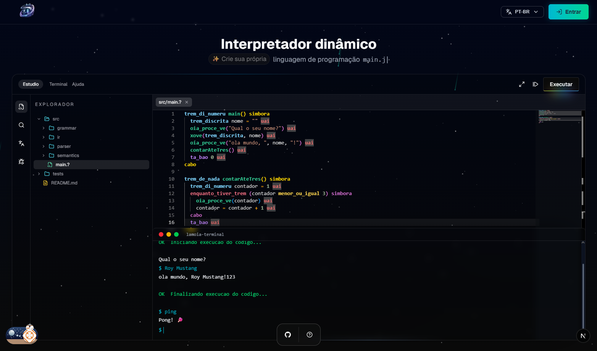
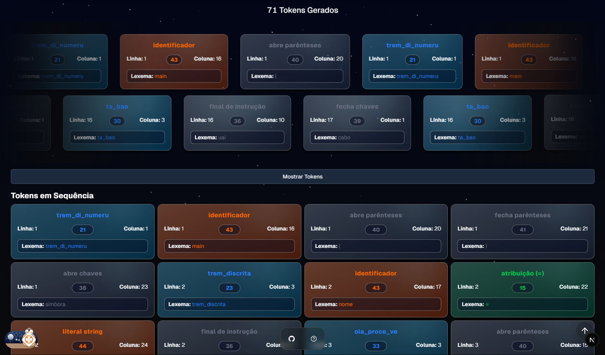
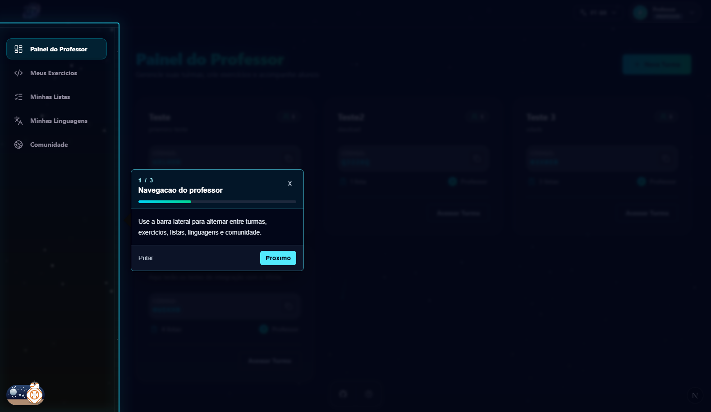
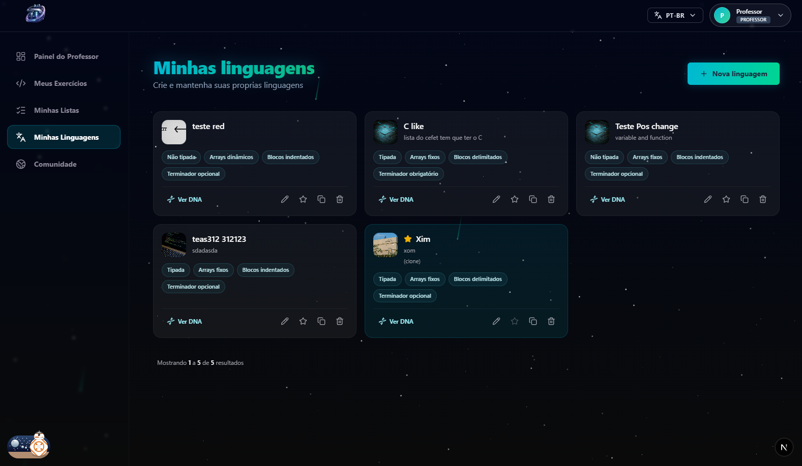
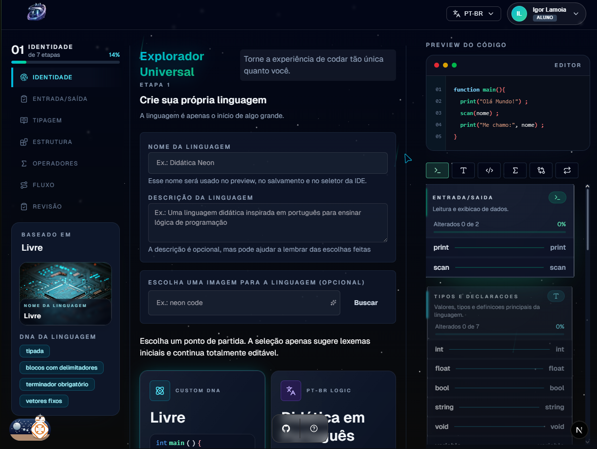
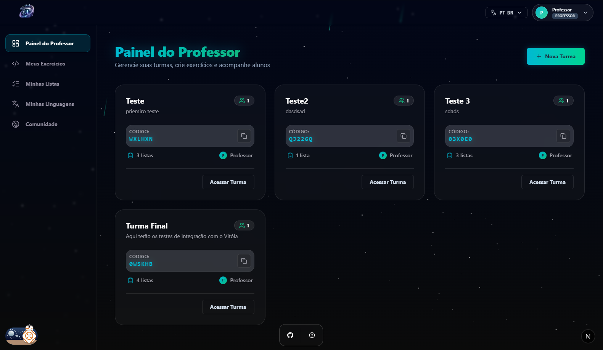
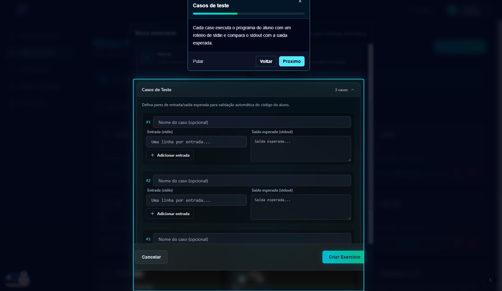
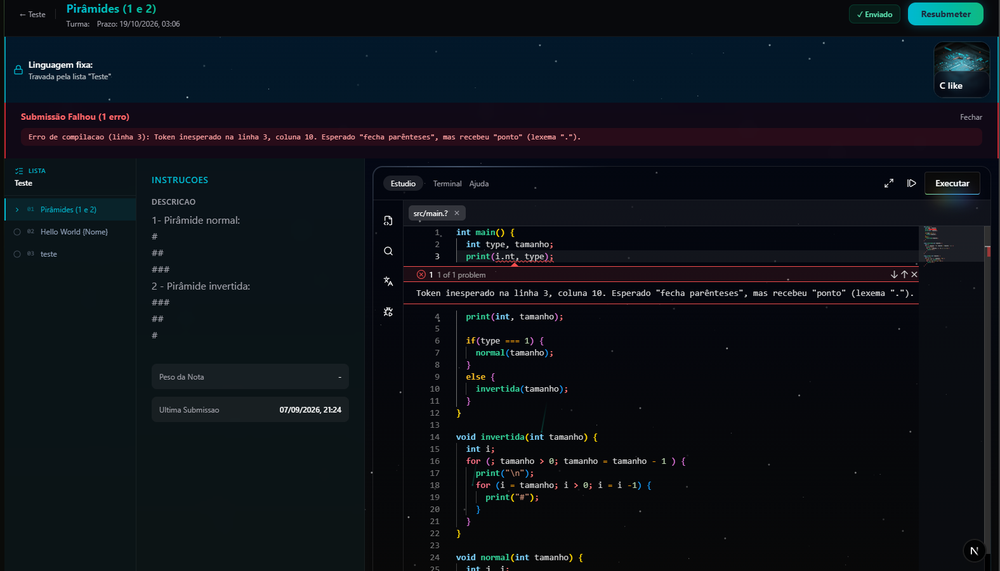
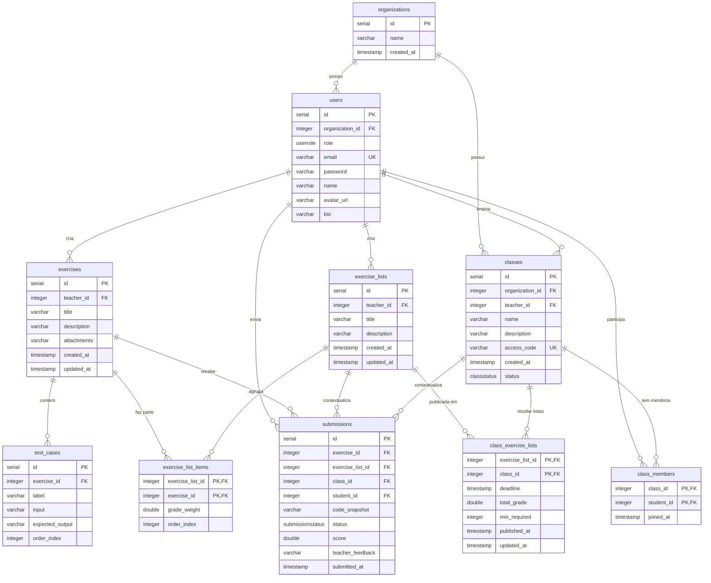

# Interpretador Dinâmico com IDE Web

Monorepo de uma plataforma web para apoio ao ensino introdutório de programação. O projeto integra uma **IDE web** a um núcleo configurável de tradução, análise e execução, permitindo que estudantes programem no navegador e que professores administrem linguagens, turmas, atividades e submissões.

<p align="center">
  <a href="#visão-geral">Visão Geral</a> &nbsp;|&nbsp;
  <a href="#galeria">Galeria</a> &nbsp;|&nbsp;
  <a href="#arquitetura">Arquitetura</a> &nbsp;|&nbsp;
  <a href="#instalação">Instalação</a> &nbsp;|&nbsp;
  <a href="#testes">Testes</a> &nbsp;|&nbsp;
  <a href="#banco-de-dados">Banco de Dados</a>
</p>



## Visão Geral

O projeto reúne três partes principais:

- **Núcleo dinâmico de tradução e execução**: aplica, a cada análise, o vocabulário e as variantes de linguagem selecionados pelo usuário.
- **IDE web educacional**: oferece editor Monaco, terminal, inspeção de resultados de análise, execução de código, depuração e gerenciamento de linguagens.
- **API da plataforma**: fornece autenticação, turmas, listas de exercícios, submissões e correção por casos de teste.

A proposta é apoiar o ensino de programação com uma experiência única para alunos e professores: escrever e executar código no navegador, personalizar linguagens didáticas, publicar atividades, acompanhar submissões e visualizar informações produzidas pela análise do programa. Os resultados atuais descrevem o artefato implementado e as verificações automatizadas realizadas; avaliações com estudantes e correções de limitações identificadas ficam como encaminhamentos futuros.

O desenvolvimento combina especificação de requisitos, modelagem da arquitetura, implementação incremental e testes automatizados. A interface concentra os fluxos de uso da plataforma: edição e execução de código, inspeção de análise, depuração, personalização de linguagem e administração de atividades de turmas.

## Galeria

### IDE e Execução


### Análise de Tokens



### Tutorial



### Linguagens Personalizadas





### Área do Professor





### Área do Aluno



## Arquitetura

O repositório é organizado como um monorepo:

| Pacote | Tecnologias | Responsabilidade |
| --- | --- | --- |
| [`packages/compiler`](./packages/compiler) | TypeScript, Vitest | Núcleo de análise, tradução intermediária e execução configurável |
| [`packages/ide`](./packages/ide) | Next.js, React, Monaco Editor, Tailwind | IDE web, assistente de personalização e fluxos educacionais |
| [`backend`](./backend) | FastAPI, SQLAlchemy async, Alembic, PostgreSQL | API REST de autenticação, turmas, exercícios e submissões |
| [`packages/e2e`](./packages/e2e) | Playwright | Testes ponta a ponta do fluxo completo |

### Fluxo do Núcleo de Execução

```text
código -> vocabulário selecionado -> análise -> representação intermediária -> execução -> saída
```

- **Vocabulário configurável**: seleciona palavras-chave e variantes de linguagem disponíveis para a análise atual.
- **Análise**: percorre o código, produz tokens e reconhece a estrutura do programa.
- **Representação intermediária**: descreve o comportamento do programa em instruções executáveis.
- **Execução**: interpreta as instruções, controla entrada e saída e apresenta o resultado na IDE.

## Instalação

### Ambiente Local Completo com Docker

Para desenvolvimento local, use o compose isolado:

```bash
make local-up
```

Serviços disponíveis:

- IDE: <http://localhost:3001>
- API do backend: <http://localhost:8000>
- Documentação da API: <http://localhost:8000/docs>
- PostgreSQL: `localhost:5434`
- Banco local: `tscompilator_local`

Comandos úteis:

```bash
make local-status
make local-logs
make local-down
make local-reset
```

O comando `make local-reset` apaga o volume local `ts-compilator-local-postgres-data`. Use apenas quando quiser recriar o banco de desenvolvimento.

Na inicialização, o backend aguarda o PostgreSQL, aplica as migrations do Alembic, executa a carga inicial local e publica linguagens oficiais no catálogo da comunidade.

### Núcleo de Execução

```bash
cd packages/compiler
npm install
npm run start
```

Para rodar os testes:

```bash
npm run test
```

O arquivo de entrada padrão fica em [`packages/compiler/src/resource/input-code.java`](./packages/compiler/src/resource/input-code.java).

### IDE

```bash
cd packages/ide
npm install
npm run dev
```

A IDE ficará disponível em <http://localhost:3001>.

A IDE consome o núcleo de execução como dependência local do monorepo: `@ts-compilator-for-java/compiler`.

### API

```bash
cd backend
uv sync
uv run alembic upgrade head
uv run uvicorn app.main:app --reload
```

Também é possível subir somente o backend e o banco via Docker:

```powershell
docker compose -f ../docker-compose.local.yml up -d --build --wait backend
```

Contas de demonstração criadas pela carga inicial local:

| Perfil | E-mail | Senha |
| --- | --- | --- |
| Professor | `professor@gmail.com` | `professor` |
| Aluno | `aluno@gmail.com` | `aluno` |

## Testes

### Testes Ponta a Ponta

O pacote [`packages/e2e`](./packages/e2e) cobre os principais fluxos do sistema com Playwright.

| Arquivo | O que protege |
| --- | --- |
| `auth.e2e.ts` | Login, cadastro, erro de senha e rotas protegidas |
| `ide-compiler.e2e.ts` | Análise, tradução intermediária e execução pela IDE |
| `lms-flow.e2e.ts` | Entrada em turma, submissão, correção e persistência |
| `custom-language.e2e.ts` | Importação de linguagem da comunidade e execução com palavras-chave customizadas |
| `smoke.e2e.ts`, `fixtures.e2e.ts` | Estrutura online e auxiliares de dados de teste |

Instalação inicial:

```bash
npm install
npm run install-browsers -w @ts-compilator-for-java/e2e
```

Execução da suíte:

```bash
make e2e
```

Variações úteis:

```bash
npm run test -w @ts-compilator-for-java/e2e -- specs/lms-flow.e2e.ts
make e2e-ui
npm run report -w @ts-compilator-for-java/e2e
```

Depois de alterar arquivos em `packages/ide`, suba a estrutura local novamente com `make local-up` para garantir que os testes usem o pacote gerado mais recente.

### Testes do Backend

```bash
cd backend
uv run pytest
```

### Testes do Núcleo de Execução e da IDE

```bash
npm run test -w @ts-compilator-for-java/compiler
npm run test -w @ts-compilator-for-java/ide
```

## Integração Contínua

O workflow [`.github/workflows/deploy.yml`](./.github/workflows/deploy.yml) roda em pull requests e em pushes para `main`:

- **unit**: suítes Vitest do núcleo de execução e da IDE, além dos testes Python do backend.
- **e2e**: sobe a estrutura local e executa a suíte Playwright.
- **deploy**: publica no VPS apenas em pushes para `main`, depois que os jobs anteriores passam.

## Hook de Pré-Push

O repositório inclui um hook local rápido para rodar testes unitários antes do push:

```bash
git config core.hooksPath .githooks
```

A suíte E2E e os testes do backend ficam fora do hook porque demoram mais. Eles rodam na CI e podem ser executados localmente quando necessário.

## Configuração de API no Next.js

Rotas de API do Next.js, como `/api/submissions/validate`, executam dentro do container do frontend e chamam o backend a partir dele. Por isso elas usam `INTERNAL_API_URL`, configurada nos arquivos compose para apontar ao serviço Docker do backend.

`NEXT_PUBLIC_API_URL` é usada pelo navegador. Ela não substitui `INTERNAL_API_URL`, porque o Next.js injeta variáveis públicas no build e, dentro do container, `localhost` aponta para o próprio frontend.

## Banco de Dados

O backend usa PostgreSQL para a camada educacional da plataforma. As migrations são gerenciadas pelo Alembic em [`backend/migrations`](./backend/migrations).


```mermaid
erDiagram
    organizations ||--o{ users : "possui"
    organizations ||--o{ classes : "possui"

    users ||--o{ exercises : "cria"
    users ||--o{ exercise_lists : "cria"
    users ||--o{ classes : "ensina"
    users ||--o{ class_members : "participa"
    users ||--o{ submissions : "envia"

    exercises ||--o{ test_cases : "contem"
    exercises ||--o{ exercise_list_items : "faz parte"
    exercises ||--o{ submissions : "recebe"

    exercise_lists ||--o{ exercise_list_items : "agrupa"
    exercise_lists ||--o{ class_exercise_lists : "publicada em"
    exercise_lists ||--o{ submissions : "contextualiza"

    classes ||--o{ class_members : "tem membros"
    classes ||--o{ class_exercise_lists : "recebe listas"
    classes ||--o{ submissions : "contextualiza"

    organizations {
        serial id PK
        varchar name
        timestamp created_at
    }

    users {
        serial id PK
        integer organization_id FK
        userrole role
        varchar email UK
        varchar password
        varchar name
        varchar avatar_url
        varchar bio
    }

    exercises {
        serial id PK
        integer teacher_id FK
        varchar title
        varchar description
        varchar attachments
        timestamp created_at
        timestamp updated_at
    }

    test_cases {
        serial id PK
        integer exercise_id FK
        varchar label
        varchar input
        varchar expected_output
        integer order_index
    }

    exercise_lists {
        serial id PK
        integer teacher_id FK
        varchar title
        varchar description
        timestamp created_at
        timestamp updated_at
    }

    exercise_list_items {
        integer exercise_list_id PK,FK
        integer exercise_id PK,FK
        double grade_weight
        integer order_index
    }

    classes {
        serial id PK
        integer organization_id FK
        integer teacher_id FK
        varchar name
        varchar description
        varchar access_code UK
        timestamp created_at
        classstatus status
    }

    class_members {
        integer class_id PK,FK
        integer student_id PK,FK
        timestamp joined_at
    }

    class_exercise_lists {
        integer exercise_list_id PK,FK
        integer class_id PK,FK
        timestamp deadline
        double total_grade
        integer min_required
        timestamp published_at
        timestamp updated_at
    }

    submissions {
        serial id PK
        integer exercise_id FK
        integer exercise_list_id FK
        integer class_id FK
        integer student_id FK
        varchar code_snapshot
        submissionstatus status
        double score
        varchar teacher_feedback
        timestamp submitted_at
    }
```

## Estrutura do Repositório

```text
.
├── backend/                  # API FastAPI, SQLAlchemy e Alembic
├── docs/                     # Documentação complementar
├── packages/
│   ├── compiler/             # Núcleo de análise, tradução e execução
│   ├── docs/                 # Documentação dos pacotes
│   ├── e2e/                  # Testes Playwright
│   └── ide/                  # IDE Next.js
├── .github/                  # Workflows de CI/CD
├── .githooks/                # Hooks locais do Git
├── docker-compose.local.yml  # Estrutura local isolada
├── docker-compose.yml        # Compose para ambientes configurados externamente
├── Makefile                  # Atalhos de desenvolvimento
└── README.MD
```

## Documentação Complementar

- [README do núcleo de execução](./packages/compiler/README.md)
- [README da IDE](./packages/ide/README.md)
- [README da API](./backend/README.md)
- [Especificação original da linguagem base](./packages/compiler/public/java--descriptionWork.pdf)
- [Decisões de design](./DESIGN.md)

## Contribuição

Contribuições são bem-vindas, especialmente novos casos de teste, melhorias na IDE e sugestões de recursos para a linguagem. Abra uma issue ou envie um pull request com uma descrição clara do problema e da solução proposta.

## Autores

- Igor Lamoia
- Victor Souza
