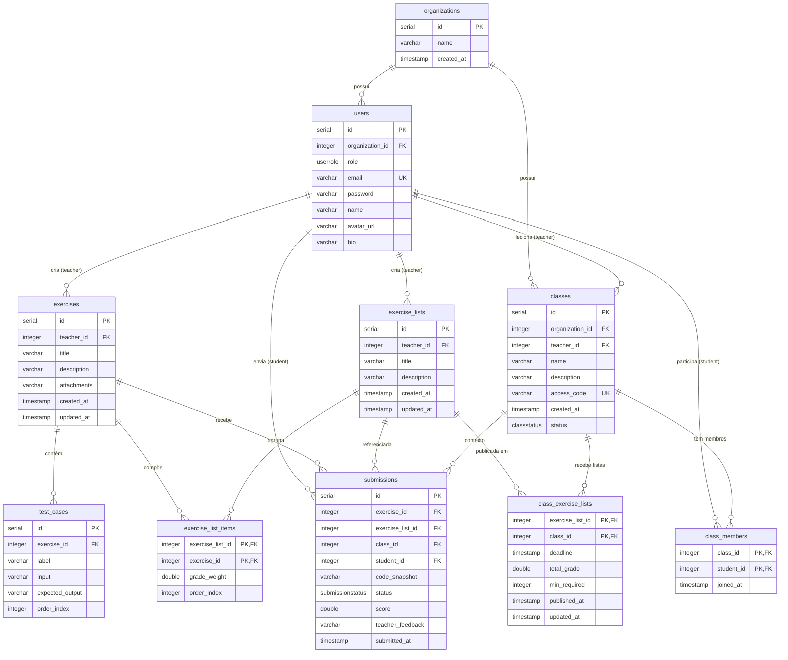

# Diagrama do Banco de Dados — Dynamic Interpreter

## Legenda dos Relacionamentos

| Origem | Destino | Cardinalidade | Significado |
|--------|---------|---------------|-------------|
| organizations | users | 1:N | Uma organização possui vários usuários |
| organizations | classes | 1:N | Uma organização possui várias turmas |
| users (teacher) | exercises | 1:N | Um professor cria vários exercícios |
| users (teacher) | exercise_lists | 1:N | Um professor cria várias listas |
| users (teacher) | classes | 1:N | Um professor leciona várias turmas |
| users (student) | class_members | 1:N | Um aluno pode estar em várias turmas |
| users (student) | submissions | 1:N | Um aluno envia várias submissões |
| exercises | test_cases | 1:N | Um exercício possui vários casos de teste |
| exercises | exercise_list_items | 1:N | Um exercício pode estar em várias listas |
| exercise_lists | exercise_list_items | 1:N | Uma lista agrupa vários exercícios |
| exercise_lists | class_exercise_lists | 1:N | Uma lista é publicada em várias turmas |
| classes | class_members | 1:N | Uma turma tem vários alunos |
| classes | class_exercise_lists | 1:N | Uma turma recebe várias listas |

## Tabelas de Associação (N:N)

- **`exercise_list_items`**: relaciona `exercise_lists` ↔ `exercises` (com peso da nota e ordem)
- **`class_members`**: relaciona `classes` ↔ `users` (alunos matriculados)
- **`class_exercise_lists`**: relaciona `classes` ↔ `exercise_lists` (com prazo e nota total)

## Enums

- **`userrole`**: papel do usuário (student, teacher, admin)
- **`submissionstatus`**: status da submissão (pending, correct, incorrect, partial)
- **`classstatus`**: status da turma (active, archived)
